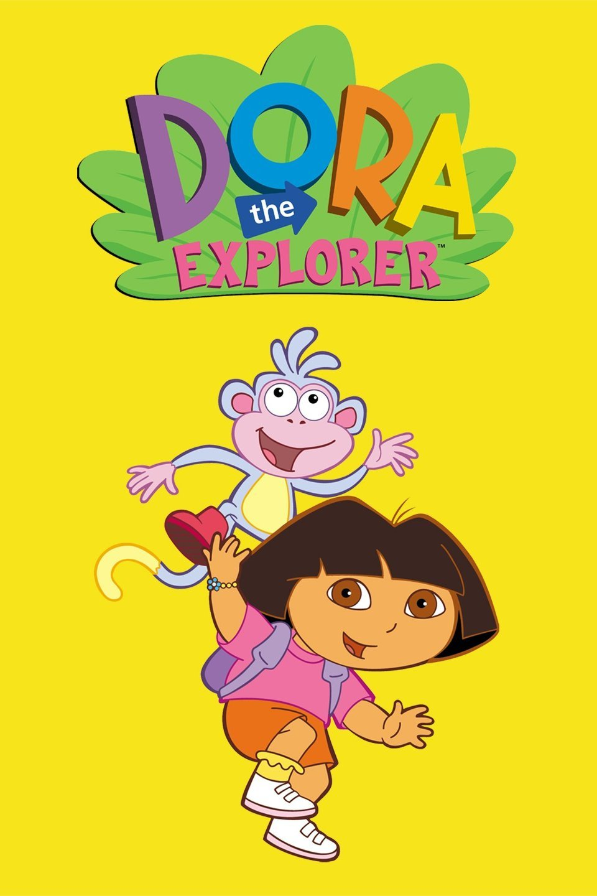

In the entertainment community many production companies need to find new projects,
proposals and ideas for new films. Many are found within the book, music and tv show
industries as they have already gained an established audience and brand which
demonstrate a concept which is already being positively received and accepted.

This activity has resulted in many tv shows now being produced into films; one in particular
that caught my eye was the 2019 release of Dora and the Lost City of Gold which was
loosely based on the Nick Jr animation Dora the Explorer. Dora the Explorer first appeared
on our screens in 2000 and was very successful staying on the air for 14 years with 8 seasons
and 197 episodes as well as 44 award nominations along with 10 wins. It has remained a
childhood memory for many and so has the distinct title screen. Dora and the Lost City of
Gold was released in 2019 and had 2 award nominations along with 4 wins. Both contain the
same characters and principles however they do not both demonstrate the same typography.

The difference in typography made it stand out to me even though it is directed towards the
same audience demographic but a more expansive age range. For Dora the Explorer, the
title screen shows bold and bright colours all with happy and exciting connotations along
with block lettering which is both appealing and easy to read which caters to their audience
demographic of 2 to 5-year olds who are still in their developmental stage. However, the
title screen is more directed towards the parents or guardians of the age demographic and
they are responsible for the content that the child watches. The heavy weight of the font
which is consistently seen throughout could be a reference to the consistency seen within
the show’s key themes and principles giving moral confirmation to the adults that it will
demonstrate good moral values throughout. The title screen text also shows a regular
contrast and width keeping it simple and easy to follow for less advanced readers and
showing that it is fun while still being a stable environment to watch. The rounding of the
text ‘Dora’ may infer an arc or obstacles that may demonstrate important values and morals
that Dora uses to face and overcome the challenges over her journey appealing to more to
the 2 nd demographic of the parents and guardians.

The movie demonstrates a change in typography, while some elements have remained the
same, others show different and less consistent typography. First the ‘Dora’ does not signal
or suggest an arc or obstacle as it retains a consistent horizontal line throughout however
that particular context could be inferred by the image behind instead of the typography
giving a more visual and image base to this particular title screen. The title screen also
reflects one consistent colour of gold throughout differing from the multiple bright and
vibrant colours seen within the title screen of Dora the Explorer, this could be the result of
the change in age demographic appealing to a more expansive and older age range as well
as hinting to the storyline. However, it does match the show by having a thick weight
emphasising and capitalising on the brand of Dora reaching out to its current and previous
fans. This also could make the audience inclined to watch it as they already have established
a positive association with the character of Dora leading them to believe that they will find it
within the film as well. Finally the Typography demonstrates the same typographical
structure with the connective words such as ‘and’, ‘the’ and ‘of’ are smaller than the others
emphasising the storyline and main character hinting to what is beyond.