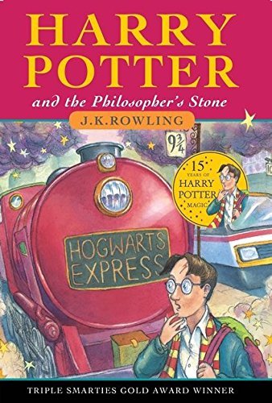
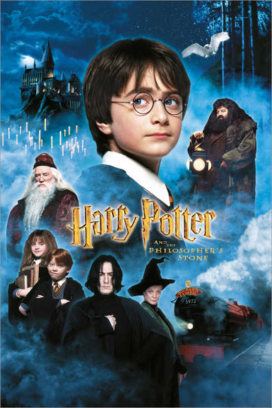

The film and TV industry have grown exponentially in the last two decades with more and more productions underway each year the amount of films actually making it to the box office lessen every year. Due to the pressure now on the films chosen to make it to the box office some certainties are now taken in order to give it a better chance of success. This had led to many looking towards the book industry for ideas and material as they have already established a following and fanbase for the film to piggyback off of. It has also created its own brand giving the film an already existing audience and platform to advertise from. 

 

One of the most successful book adaptations of all time has been the best-selling Harry Potter series by JK Rowling with her first book Harry Potter and the Philosopher’s stone generating approximately £120 million. This critically acclaimed series has been translated into 80 languages, won multiple awards and sold more than 500 million copies worldwide, becoming the best-selling book series in history. These were soon followed by eight blockbuster films the first Harry Potter and the Philosopher’s Stone grossing at a total £239,726,667 with similar sums in the other seven. It has become a British cultural phenomenon and a seen referenced throughout social situations. Therefore, this well-known title has a very famous and recognisable title screen with unique typography seen both on the book cover and title screen. Specifically, seen in of the first book and movie released as the typography was formed under different circumstances.

 

The first Harry Potter book, the Philosopher’s Stone was released in 1997 and became a best seller straight away. This immediate success paved the way for the for the following six books and created a brand with its demographic close behind with the unique typography now associated with these books in their mind. The book demonstrates a unique typography in the fact that the Harry Potter brand had not been formed yet and was the first look into that world and was the site in which that whole universe was built. It did not have the platform or preformed fanbase that the film did. The cover for Harry Potter and the Philosopher’s stone represents and hints towards the contents as seen by the background. The different typographical sections seen on the cover hint towards specific story plots and is seen within the typography used.  The ‘HARRY POTTER’ has a thick weight with regular contrast and width maybe hinting towards Harrys character personality as he is reliable, sturdy and stands his ground for the people he loves and is not fragile as he will fight for what is right. Going down the cover to ‘and the Philosopher’s Stone’ it has a different typeface and is reduced in size compared to the ‘HARRY POTTER’ indicating to the audience the main character and that the forefront of the storyline will be Harry. The philosophers stone will just be the target of his specific journey/adventure. The font demonstrates and thin weight and high contrast with a regular width giving the typeface a more delicate and fragile look and presenting a less intense view compared to the ‘HARRY POTTER’ suggesting that is less of a priority within the story. Finally, the ‘HOGWARTS EXPRESS’ shows a light weight alongside a regular contrast and regular width as well as a high X height. This could suggest to the audience that there is something unique about this train and the fact that it is shown on the cover implies that it is crucial to the storyline. It also makes the audience question what is Hogwarts? And may tempt them into reading the book to find out. 

 

The film cover also represents two different typefaces with ‘Harry Potter’ not capitalised throughout and is angled in an arrow shape pointing towards the picture of Harry indicating who is playing the main character. It shows thick weight and regular width suggesting again that Harry is still reliable, sturdy and stands his ground however is represented in a different font with a slightly high contrast looking more like quill writing and hinting towards the Harry Potter universe which many of the fandom will already know. This new font also shows the tail of the ’P’ in the shape of a lightning bolt shining a spotlight on Harrys scar indicating that in the film the scar will be more prominent in the storyline. Finally, ‘AND THE PHILOSOPHER’S STONE’ has been capitalised showing more of an emphasis on this part of the adventure within the storyline and its involvement within the characters dynamic is more prominent. It’s presented in a thin weight with regular contrast and regular width implying it is a strong and sturdy journey and adventure surrounding this object. Overall the difference in circumstance is seen within the typography of both book and film representing the brand and demographic.