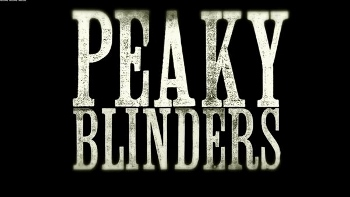
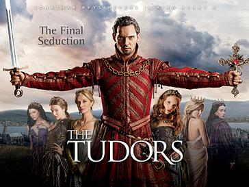

The past is an amazing thing filled with how the world we know came to be. It is an insight into those who came before us and shaped the reality that we see today. The people, the culture and the style of the past is seen all around us and can be seen within the writing and development of historic shows and period pieces. A specific typography can tell you a lot about where from the past you will be looking and what adventures you shall take place in throughout history with a show or film. 

 

The typography can represent a specific time period or key moment in history giving insight and depth before the audience has begun to watch and learn more. Peaky Blinders a show released by the BBC in 2013 and follows the life of the Peaky Blinders, a gangster family set in Birmingham England, in 1919, several months after the end of the first world war in 1918. It closely follows the gang and their leader Tommy Shelby. Many aspects of the Peaky Blinder franchise has become prominent in British culture and society, involving haircuts, costumes and quotes. Its brand has become famous along with its title screen which demonstrates capitalisation throughout with a heavy weight and low X height creating a strong and stable representation of the gang and how they operate. It also shows a condensed width and font which resembles a typewriter hinting towards the 1919s time period where typewriters were used throughout the first world war and for many years after. The colouring of the ‘PEAKY BLINDERS’ could also indicate the time period and setting of the show as it demonstrates the colours seen throughout the shows run in Birmingham at the time. 

 

In contrast the Tudors television series is based around the life of the infamous King of England, Henry VIII, and his six wives, taking place in the sixteenth century. The Tudors are important and staple in British history as the infamous story of Henry VIII and his six wives is built into the British culture and education. The title represents the time period of the sixteenth century through its light weight, regular contrast and regular width. This indicates a very sophisticated and delicate font referencing to the fragile nature of ruling as it could be broken at any time if certain requirements are not met to continue the Tudor lineage. Its capitalisation throughout also magnifies the significance of the Tudors and demonstrates to the audience what the main focus of this show will be along with the larger font size of the word ‘TUDORS’ to indicate the enormity and presence of this family within the show and in history.  Overall many shows need to entice the audience by hinting to the time period to intrigue them and get them to watch more.